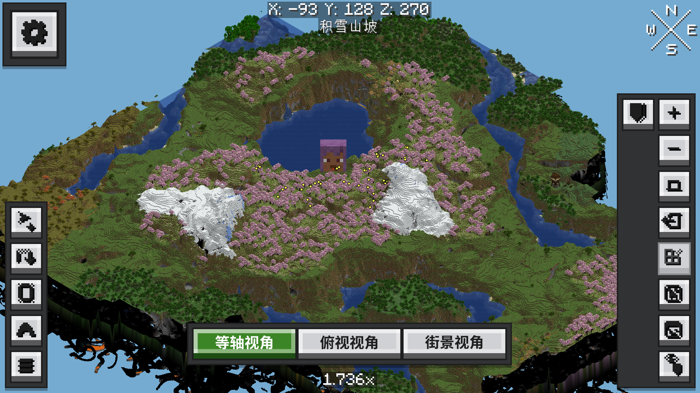
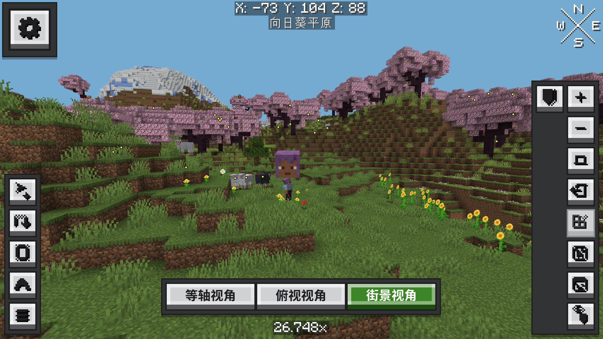

# Xaero's World Map: Earth

**3D terrain, three camera views and an Ore-style interface for Xaero's World Map.**

[Download](https://github.com/kltyton/XaeroWorldMapEarth/releases/latest) · [中文介绍](publishing/curseforge/text/zh_cn.md) · [Report an issue](https://github.com/kltyton/XaeroWorldMapEarth/issues)

Earth is a client-side addon for Xaero's World Map. Explore your world in 3D with Minecraft block models and resource-pack textures, switch between isometric, top-down and street views, and keep using your Xaero maps and waypoints.



## Download and installation

Download the JAR for your Minecraft version and loader, then place it in your client's `mods` folder.

**Required:**

- [Xaero's World Map](https://www.curseforge.com/minecraft/mc-mods/xaeros-world-map)
- [XaeroLib (Xlib)](https://www.curseforge.com/minecraft/mc-mods/xaerolib)
- [Fabric API](https://www.curseforge.com/minecraft/mc-mods/fabric-api) for Fabric releases

**Optional:** [Xaero's Minimap](https://www.curseforge.com/minecraft/mc-mods/xaeros-minimap) adds entity models to the map, using its radar filters and server permissions.

ApricityUI 1.2.7 and Rhino are bundled in the release JARs.

### Version 0.1.0

| Minecraft | Loader | Java | Download |
| --- | --- | --- | --- |
| 1.18.2 | Forge | 17 | [forge-1.18.2](https://github.com/kltyton/XaeroWorldMapEarth/releases/download/v0.1.0/xaero-world-map-earth-forge-1.18.2-0.1.0.jar) |
| 1.19.2 | Forge | 17 | [forge-1.19.2](https://github.com/kltyton/XaeroWorldMapEarth/releases/download/v0.1.0/xaero-world-map-earth-forge-1.19.2-0.1.0.jar) |
| 1.20.1 | Forge | 17 | [forge-1.20.1](https://github.com/kltyton/XaeroWorldMapEarth/releases/download/v0.1.0/xaero-world-map-earth-forge-1.20.1-0.1.0.jar) |
| 1.20.1 | Fabric | 17 | [fabric-1.20.1](https://github.com/kltyton/XaeroWorldMapEarth/releases/download/v0.1.0/xaero-world-map-earth-fabric-1.20.1-0.1.0.jar) |
| 1.21.1 | Fabric | 21 | [fabric-1.21.1](https://github.com/kltyton/XaeroWorldMapEarth/releases/download/v0.1.0/xaero-world-map-earth-fabric-1.21.1-0.1.0.jar) |
| 1.21.1 | NeoForge | 21 | [neoforge-1.21.1](https://github.com/kltyton/XaeroWorldMapEarth/releases/download/v0.1.0/xaero-world-map-earth-neoforge-1.21.1-0.1.0.jar) |
| 26.1.2 | Fabric | 25 | [fabric-26.1.2](https://github.com/kltyton/XaeroWorldMapEarth/releases/download/v0.1.0/xaero-world-map-earth-fabric-26.1.2-0.1.0.jar) |
| 26.1.2 | NeoForge | 25 | [neoforge-26.1.2](https://github.com/kltyton/XaeroWorldMapEarth/releases/download/v0.1.0/xaero-world-map-earth-neoforge-26.1.2-0.1.0.jar) |
| 26.2 | NeoForge | 25 | [neoforge-26.2](https://github.com/kltyton/XaeroWorldMapEarth/releases/download/v0.1.0/xaero-world-map-earth-neoforge-26.2-0.1.0.jar) |

## Features

| Feature | Description |
| --- | --- |
| 3D terrain | Terrain and buildings use Minecraft block models and your resource-pack textures. Distant areas use Xaero's recorded colors and heights, with details updated as models load. |
| Three camera views | Isometric, top-down and street views, with rotation, zoom and a freely movable street-view camera. |
| Ore-style interface | Map controls, settings pages, dropdowns, sliders and menus use Ore-McUI styling. |
| Waypoints | Create, edit and delete waypoints through Xaero's existing menus. |
| Player and entity markers | Player heads use current skins and stay bright in caves. Optional Minimap integration displays permitted loaded entities as models. |
| Worlds and caves | Browse Xaero's worlds, dimensions and cave layers using your existing map data. |
| Theme toggle | Switch between Earth and Xaero's original interface through the theme setting. |



## Controls

| Action | Input |
| --- | --- |
| Open the map | Xaero's World Map key, `M` by default |
| Pan in isometric or top-down view | Left-drag |
| Rotate in isometric view | Middle-drag |
| Zoom | Mouse wheel |
| Change view | View buttons at the bottom of the map |
| Turn the street-view camera | Left- or middle-drag |
| Move the street-view camera | `WASD`, `Space` to rise, `Shift` to descend |
| Manage waypoints | Xaero's context menus and waypoint interface |

## Building from source

Each directory under `targets/` is an independent Gradle project. Use the Java version listed above and a matching AUI JAR built from the [corresponding AUI source](https://github.com/kltyton/AUI/tree/bda94fe30072b610dd71713935d2d939c817bc89).

For example, on Windows:

```powershell
cd targets/neoforge-26.2
.\gradlew.bat assemble --no-daemon "-PauiJar=C:/path/to/ApricityUI-neoforge-26.2-1.2.7.jar"
```

On Linux or macOS, use `./gradlew` with the same arguments. Release JARs are written to the target's `build/libs/` directory. Earth 26.1.2 targets use the matching AUI 26.1 target.

## Credits and license

Developed by [kltyton](https://github.com/kltyton). Earth is licensed under [MIT](LICENSE).

- [Xaero's World Map](https://www.curseforge.com/minecraft/mc-mods/xaeros-world-map), XaeroLib and Xaero's Minimap by Xaero96.
- [ApricityUI](https://github.com/Tower-of-Sighs/AUI) by Tower of Sighs and contributors, licensed under LGPL-2.1.
- Rhino by Mozilla, LatvianModder / latvian.dev and contributors, licensed under MPL-2.0.
- OreUI / mcui-oreui and Vue contributors.

Bundled-library licenses and source links are listed in [Third-party notices](licenses/NOTICE.md).
